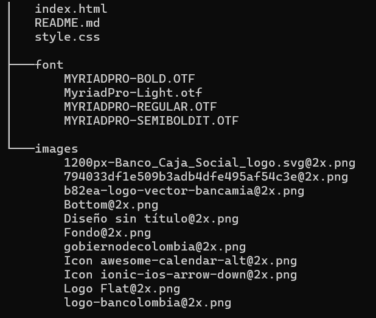

# Ingreso Solidario
## Descripción
Esta es una página web donde pueden consultar si son beneficiarios del ingreso solidario y tambien informacion extra.
La página es adaptable para pc o algun dispositivo movil

## Tecnologias utilizadas:
- HTML 5
- CSS 3

## Archivos
- **font:** Carpeta que contiene toda la tipografía usada en la página 
- **images** Es una carpeta que almacena todas las imgenes utilizadas en la página
- **index.html** El el archivo principal de html
- **style.css** Es un archivo CSS que contiene todos los estilos de la pagina

## estructura

## Ejecución
para poder ejecutar esta página deberas seguir una serie de pasos
### paso 1
Primero deberas descargar este repositorio y abrirlo con **visual estudio code**
### paso 2
estando en visual deberas descargar una extención que se llama **Live Server**
### paso 3
a continuacion tendras que dirigirte al archivo **index.html**
### paso 4 
estando en este archivo encontraras en la esquina inferior derecha un apartado que dice *Go Live* le das click y se te redigirá automaticamente a la página
## Autor
- Luis Miguel Caicedo Bermon